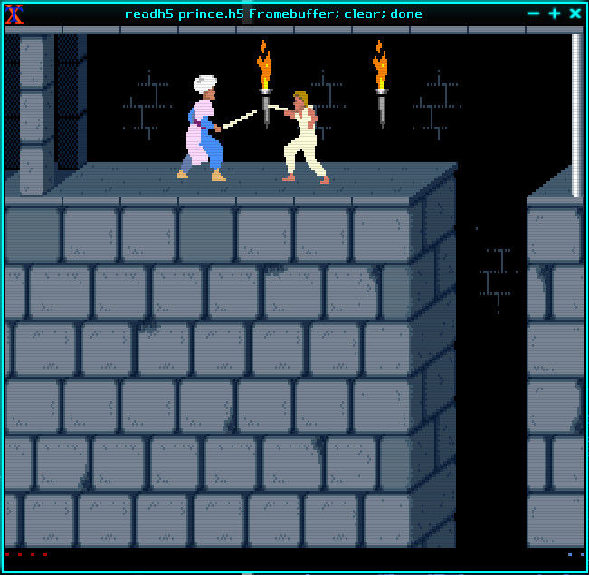

# Play the classic Prince of Persia game through HDF5

## Description

This example uses a [modified version of an open source Prince of Persia game engine](
https://github.com/lucasvr/prince_of_persia-hdf5) that exports the game display
through a System V shared memory segment.
 
Each time the dataset is read, the user-defined function attaches to that
shared memory segment and retrieves the game's most recent framebuffer.
It then encodes that data as a regular bi-dimensional HDF5 dataset which
can be printed using regular tools.

## Data preparation

First, download and install the modified game engine. Next, compile the
UDF and attach it to an existing HDF5 file (in this example, `prince.h5`) with:

```
hdf5-udf prince.h5 prince.cpp Framebuffer:320x200x3:uint8
```

## Data consumption

Open a new window and launch the Prince of Persia executable. Wait until the
game starts and then launch the [readh5 utility](
https://github.com/lucasvr/hdf5-udf/blob/default/examples/readh5.cpp)
in a loop so that the game video frames are contiguously shown as you play it.

```
xterm -bg black -fa 'Monospace' -fs 1 -geometry 640x200 -e 'while true; do readh5 prince.h5 Framebuffer; clear; done'
```


