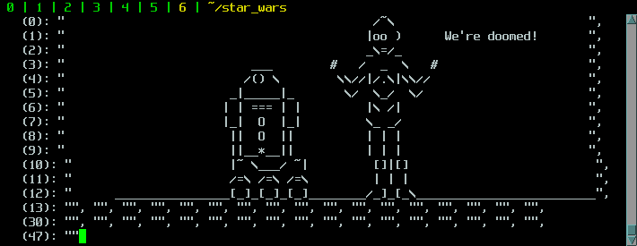

# ASCII-art Star Wars animation on HDF5

## Description

Connects to a telnet service serving ASCII-art frames of Star Wars.

Each time the dataset is read, it connects to the telnet service and
retrieves the most recent ASCII-art video frame. That video frame is
translated into a string-based HDF5 dataset that can be read using
traditional HDF5 tools.

This example uses a [modified version of the ascii-telnet-server](
https://github.com/lucasvr/ascii-telnet-server) that serves a single
client at a time.

## Data preparation

First, download and install the `ascii-telnet-server` package. Next,
build the UDF as shown:

```
hdf5-udf dataset.h5 star_wars.py 'star_wars:48:string(73)'
```

## Data consumption

Open a new window and launch the telnet server:

```
python ascii_telnet_server.py -i 127.0.0.1 -f sample_movies/sw1.txt
```

Launch the `h5dump` utility in a loop to watch the video:

```
while true; do h5dump -O /dev/null -d /star_wars dataset.h5; sleep 0.1; done
```


