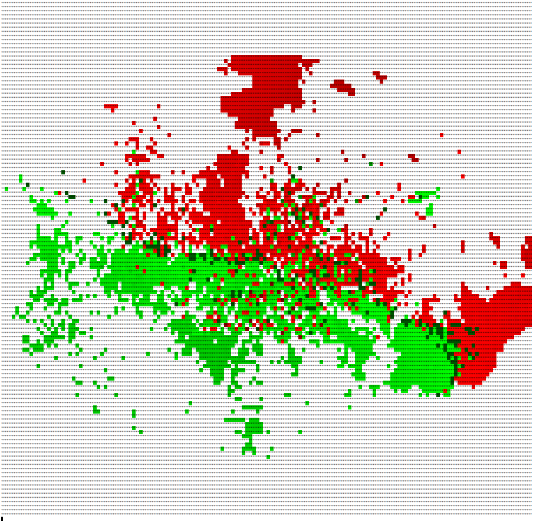

# Real-time weather velocity readings using HDF5

## Description

Gets real-time weather velocity readings from Chicago O'Hare International
Airport's weather radar. The data is provided by
[NCEP](https://opengeo.ncep.noaa.gov/geoserver/www/index.html)
in PNG format. This user-defined function retrieves the most recent PNG data
and converts it into a look-up table that's exported as a dataset named
`RadialVelocity`. A color palette named `Palette` is also exported so that
applications wishing to render the original PNG image can do so.

## Data preparation

This UDF uses the `owslib` package to access the web map services provided by
GeoServer and the `png` package to read the PNG image. You can install both
dependencies `pip install owslib pypng`.

Assuming a reference HDF5 file named `radar.h5`, please run the following
command to create the user-defined dataset:

```
hdf5-udf radar.h5 ncep.py RadialVelocity:150x125:uint8 Palette:10000:uint8
```

## Data consumption

The numerical look-up table can be read using the standard `h5dump` tool.
You get a much better output by using a tool that converts each numerical
value from that table into a RGB color of the palette. The output below
is generated by the [readh5 utility](https://github.com/lucasvr/hdf5-udf/blob/default/examples/readh5.cpp)
that comes with the HDF5-UDF distribution.

```
xterm -fa 'Monospace' -fs 4 -geometry 300x126 -e 'readh5 radar.h5 RadialVelocity Palette; read'
```


